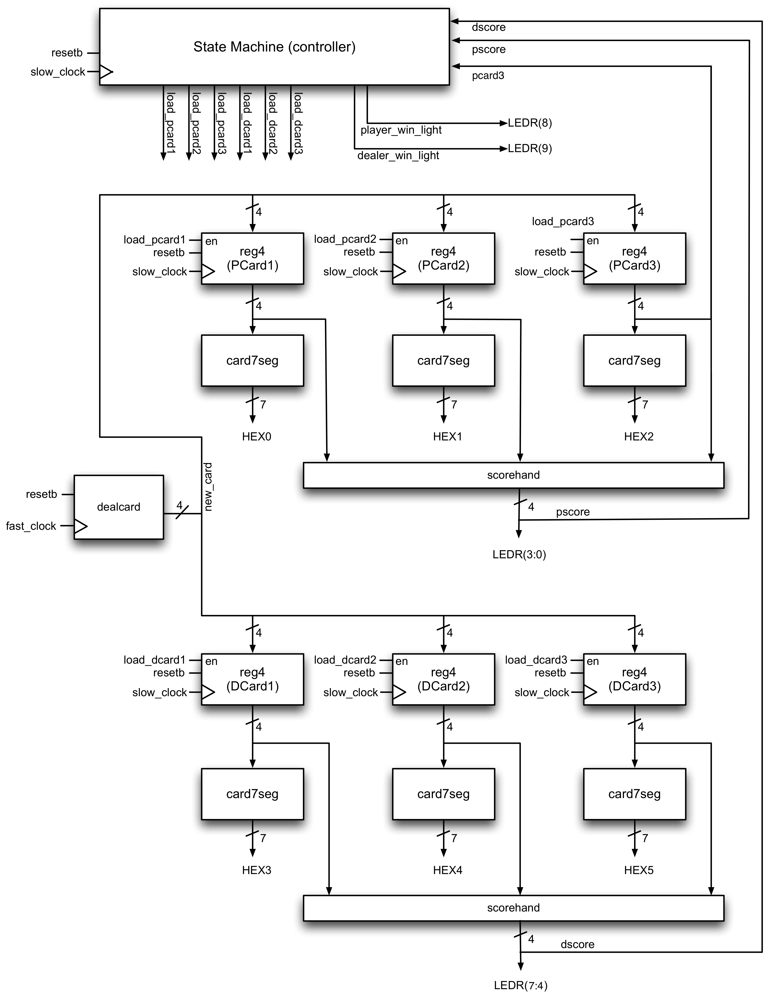

# Baccarat-Game-Engine
#### Rules

- Two cards are dealt to both the player and the dealer (i.e., the banker) face up (first card to the player, second card to dealer, third card to the player, fourth card to the dealer).
- The score of each hand is computed as described under _Score_ below.
- If the player’s or banker’s hand has a score of 8 or 9, the game is over (this is called a “natural”) and whoever has the higher score wins (if the scores are the same, it is a tie)
- Otherwise, if the player’s score from his/her first two cards was 0 to 5:
  - the player gets a third card
  - the banker may get a third card depending on the following rule:
    1. If the banker’s score from the first two cards is 7, the banker does not take another card
    1. If the banker’s score from the first two cards is 6, the banker gets a third card if the face value of the player’s third card was a 6 or 7
	1. If the banker’s score from the first two cards is 5, the banker gets a third card if the face value of the player’s third card was 4, 5, 6, or 7
    1. If the banker’s score from the first two cards is 4, the banker gets a third card if the face value of player’s third card was 2, 3, 4, 5, 6, or 7
    1. If the banker’s score from the first two cards is 3, the banker gets a third card if the face value of player’s third card was anything but an 8
	1. If the banker’s score from the first two cards is 0, 1, or 2, the banker gets a third card.
- Otherwise, if the player’s score from his/her first two cards was 6 or 7:
  - the player does _not_ get a third card
  - if the banker’s score from his/her first two cards was 0 to 5:
    - the banker gets a third card
  - otherwise the banker does not get a third card
- The game is over. Scores are computed as below. Whoever has the higher score wins, or if they are the same, it is a tie.

#### Score

The score of each hand is computed as follows:

- The value of each card in each hand is determined. Each Ace, 2, 3, 4, 5, 6, 7, 8, and 9 has a value equal the face value (eg. Ace has value of 1, 2 is a value of 2, 3 has a value of 3, etc.). Tens, Jacks, Queens, and Kings have a value of 0.
- The score for each hand (which can contain up to three cards) is then computed by summing the values of each card in the hand, and the rightmost digit (in base 10) of the sum is the score of the hand. In other words, if Value1 to Value 3 are the values of Card 1 to 3, then

  Score of hand = (Value1 + Value2 + Value3) mod 10

  If the hand has only two cards, then Value3 is 0. You should be able to see that the score of a hand is always in the range [0,9].

It is interesting to note that in this version of the game, all moves are automatic (the player does not have to make any decisions!). The version played in Monte Carlo is slightly different, in that a player can choose whether or not to take a third card. We will not consider that here.

First, consider the behaviour of the Baccarat circuit from the user’s point of view. As shown in the figure below, the circuit is connected to two input keys, a 50MHz clock, and the output of the circuit drives six seven-segment LEDs and ten lights.

The game starts by asserting the reset signal (KEY3) which is **active-low** and **synchronous**. The user can then step through each step of the game (deal one card to the player, one to the dealer, etc) by pressing KEY0 (this will be referred as **slow_clock** in this document). The exact sequence of states will be described below. As the cards are dealt, the player’s hand is shown on HEX0 to HEX2 (one hex digit per card — remember each hand can contain up to three cards) and the dealer’s hand is shown on HEX3 to HEX5. The current score of the player’s hand will be shown on lights LEGR3 to LEGR0 (recall that the score of a hand is always in the range [0,9] and can be represented using four bits), and the current score of the dealer’s hand will be shown on LEGR7 to LEGR4. We use lights to display the binary version of the score, since the DE1-SoC only has six hex digits.

There is also a 50MHz clock input; this is used solely for clocking the dealcard block which deals a random card. This will be described further in a subsequent task.

At the end of the game, red lights 8 and 9 will indicate the winner: if the player wins, light LEDR(8) goes high. (In your implementation, you may delay this until KEY0 has been pressed one more time after the winning card has been dealt). If the dealer wins, light LEDR(9) goes high. If it is a tie, both LEDR(8) and LEDR(9) go high. The system then does nothing until the user presses reset and clock, sending it back to the first state to deal another hand.

Notice that, other than cycling through the states using KEY0 (the slow clock), the user does not need to do anything. This is consistent with the description of the game above.

The circuit consists of two parts: a state machine and a datapath. The datapath does all the “heavy lifting” (in this case, keeping track of each hand and computing the score for each hand) and the state machine controls the datapath (in this case, telling the datapath when to load a new card into either the player’s or dealer’s hand). The overall block diagram is shown below.

